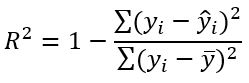

# Laporan Proyek Machine Learning

### Nama : Nisa Febrianti

### Nim : 211351103

### Kelas : TIF Pagi A

## Domain Proyek


Angka harapan hidup adalah rata-rata kesempatan atau waktu hidup yang tersisa bagi penduduk suatu negara atau daerah. Angka harapan hidup merupakan salah satu indikator untuk menilai derajat kesehatan dan kesejahteraan masyarakat. Semakin tinggi angka harapan hidup, maka semakin baik pula kondisi kesehatan, nutrisi, sanitasi, dan pelayanan kesehatan di suatu negara atau daerah. Angka harapan hidup dipengaruhi oleh berbagai faktor, negara khususnya negara berkembang kerap kesusahan mengendalikan seluruh faktor guna meningkatkan angka harapan hidup. Dengan proyek ini harapannya negara dapat mengetahui faktor apa saja yang menentukan tingkat harapan hidup masyarakat. Masyrakat pun dengan proyek ini harapannya dapat mengetahui angka harapan hidup suatu negara guna mengkaji ulang kebijakan negra tersebut.

## Business Understanding

### Problem Statements

- Banyaknya faktor yang menentukan angka harapan hidup.
- Masyarakat tidak mengetahui cara menghitung skala angka harapan hidup yang layak.

### Goals

- Masyrakat dapat mengetahui angka harapan hidup suatu negara berdasarkan beberapa faktor.
- Negara dapat mengetahui faktor apa saja yang menjadi faktor penting untuk menentukan angka harapan hidup.

### Solution statements

- Membangun suatu sistem yang dapat mempelajari suatu data (Machine Learning) melakukan estimasi angka harapan hidup suatu negara
- Sistem berjalan dengan menggunakan metode Polynomial Features yang dinilai cocok untuk melakukan estimasi pada dataset ini.

## Data Understanding

Dataset yang digunakan berasal dari situs Kaggle. Dataset ini mengandung 1649 entries dan 22 columns<br>

Link Dataset: [Angka harapan hidup](https://www.kaggle.com/datasets/uom190346a/health-and-demographics-dataset/data).

### Variabel-variabel yang terdapat pada Dataset adalah sebagai berikut:

- Country = Nama Negara
- Year = Tahun data diambil
- Status = Apakah negara tersebut berkembang atau sudah maju
- Life Expectancy = Angka harapan hidup
- Adult Mortality = Angka Kematian Orang Dewasa: Mengukur probabilitas kelangsungan hidup antara usia 15 dan 60 tahun per 1.000 penduduk.
- Kematian Bayi = Angka kesehatan bayi dengan jumlah kematian bayi per 1.000 kelahiran hidup.
- Alcohol = Angka rata-rata konsumsi alkohol dalam liter per kapita.
- Percentage Expenditure: Menggali pengeluaran kesehatan sebagai persentase PDB suatu negara.
- Hepatitis B: Mengukur cakupan imunisasi untuk Hepatitis B.
- Campak: Periksa dampak penyakit yang dapat dicegah ini dengan jumlah kasus yang dilaporkan per 1.000 penduduk.
- BMI: skala kesehatan nasional dengan rata-rata Indeks Massa Tubuh.
- Under-Five Deaths: Menyoroti kematian anak dengan jumlah kematian balita per 1.000 kelahiran hidup.
- Polio: cakupan imunisasi untuk Polio.
- Total Expenditure :total pengeluaran kesehatan sebagai persentase PDB
- Diphtheria : cakupan imunisasi untuk Diphtheria
- HIV/AIDS : prevalensi HIV/AIDS sebagai persentase populasi.
- GDP : perkembangan keuangan suatu negara dengan data Produk Domestik Bruto
- Population : Populasi suatu negara
- Thinness 1-19 Years
- Thinness 5-9 Years
- Income Composition of Resources: indeks gabungan yang mencerminkan distribusi pendapatan dan akses sumber daya.
- Schooling : Angka rata-rata pendidikan masyrakat dalam skala tahun

## Data Preparation

Pertama-tama import semua library yang dibutuhkan,

```bash
import pandas as pd
import numpy as np
import matplotlib.pypot as plt
import seaborn as sns
```

Setelah itu kita akan men-definsikan dataset menggunakan fungsi pada library pandas

```bash
df = pd.read_csv('Life_Expectancy_Data.csv')
pd.set_option('display.max_columns', None)
```

Lalu kita akan melihat informasi mengenai dataset dengan syntax seperti dibawah:

```bash
df.info()
```

Dengan hasil sebagai berikut:

```bash
<class 'pandas.core.frame.DataFrame'>
RangeIndex: 1649 entries, 0 to 1648
Data columns (total 22 columns):
 #   Column                           Non-Null Count  Dtype
---  ------                           --------------  -----
 0   Country                          1649 non-null   object
 1   Year                             1649 non-null   int64
 2   Status                           1649 non-null   object
 3   Life expectancy                  1649 non-null   float64
 4   Adult Mortality                  1649 non-null   int64
 5   infant deaths                    1649 non-null   int64
 6   Alcohol                          1649 non-null   float64
 7   percentage expenditure           1649 non-null   float64
 8   Hepatitis B                      1649 non-null   int64
 9   Measles                          1649 non-null   int64
 10   BMI                             1649 non-null   float64
 11  under-five deaths                1649 non-null   int64
 12  Polio                            1649 non-null   int64
 13  Total expenditure                1649 non-null   float64
 14  Diphtheria                       1649 non-null   int64
 15   HIV/AIDS                        1649 non-null   float64
 16  GDP                              1649 non-null   float64
 17  Population                       1649 non-null   float64
 18   thinness  1-19 years            1649 non-null   float64
 19   thinness 5-9 years              1649 non-null   float64
 20  Income composition of resources  1649 non-null   float64
 21  Schooling                        1649 non-null   float64
dtypes: float64(12), int64(8), object(2)
memory usage: 283.5+ KB
```

<br>

Kita juga akan melihat tingkat korelasi antar kolom


Korelasi antar kolom perlu diperhatikan guna memilih feature dengan tepat. Dari data diatas, nilai dengan korelasi tertinggi adalah schooling, income, gdp, diphtheria, bmi, percentage, alcohol, status

Selanjutnya memeriksa apakah ada data yang berisi nilai null pada dataset:

```bash
df.isna().sum()
```

Dengan hasil sebagai berikut:

```bash
Country                            0
Year                               0
Status                             0
Life expectancy                    0
Adult Mortality                    0
infant deaths                      0
Alcohol                            0
percentage expenditure             0
Hepatitis B                        0
Measles                            0
 BMI                               0
under-five deaths                  0
Polio                              0
Total expenditure                  0
Diphtheria                         0
 HIV/AIDS                          0
GDP                                0
Population                         0
 thinness  1-19 years              0
 thinness 5-9 years                0
Income composition of resources    0
Schooling                          0
dtype: int64
```

 <br>

Setelah memeriksa bahwa dataset yang kita gunakan tidak terdapat nilau null / NaN, maka tahap cleaning tidak diperlukan.

### Mengganti kolom kategori menjadu numerik

Di salah satu label/column yang paling berpengaruh terhadap angka harapan hidup, ada label/column status yang tipe datanya object. Kita perlu menggantinya menjadi numerik agar data tersebut dapat diolah kedalam model regresi linear

### Merubah kolom status menjadi numerik

Kita akan memeriksa value apa saja yang bukan numerik yang ada di kolom status

```bash
y = [x for x in df['Status'] if isfloat(x) == False]
print(y)
```

> ['Developing', 'Developing', 'Developing', 'Developing', 'Developing', 'Developing', 'Developing', 'Developing', 'Developing', 'Developing', 'Developing', 'Developing', 'Developing', 'Developing', 'Developing', 'Developing', 'Developing', 'Developing', 'Developing', 'Developing', 'Developing', 'Developing', 'Developing', 'Developing', 'Developing', 'Developing', 'Developing', 'Developing', 'Developing', 'Developing', 'Developing', 'Developing',...]

value tersebut beserta tipe datanya kita ubah menjadi numerik

```bash
df['Status']=df['Status'].replace(['Developing','Developed'],['0','1'])
df[['Status']]=df[['Status']].apply(pd.to_numeric)
```

### Merubah nama kolom

Label-label yang sangat berpengaruh yang nantinya akan kita pakai menjadi feature, memiliki nama yang cukup panjang dan memiliki spasi. Hal ini akan berpengaruh terhadap kerapihan ataupun codingan kedepannya

```bash
df.rename(columns = {"Schooling":"schooling","Income composition of resources":"icr","percentage expenditure":"pe"},inplace=True)
df.rename(columns = {" BMI ":"bmi","Diphtheria ":"diphtheria","Life expectancy ":"life_expectancy","GDP":"gdp"},inplace=True)
```

### Membuat feature

Setelah seluruh kolom bertipe data integer dan memiliki nama yang cukup rapih, maka kita dapat membuat fitur dari kolom-kolom tersebut.
Feature digunakan sebagai parameter menghitung hasil estimasi/prediksi yang diharapkan. Hasil estimasi di dataset ini adalah kolom life_expectancy. Untuk membuat feature dan target dengan codingan sbgai berikut:

```bash
features = ['schooling','icr','gdp','diphtheria','bmi','pe','Alcohol','Status']
x = df[features]
y = df['life_expectancy']
x.shape, y.shape
```

### Split Dataset untuk Training dan Testing

Ketika akan melakukan proses perhitungan dengan metode regresi linear, maka dataset harus dibagi menjadi dua jenis yaitu training dan testing. Split dataset menggunakan fungsi train_test_split.

```bash
from sklearn.model_selection import train_test_split
x_train, x_test, y_train, y_test = train_test_split(x,y,random_state=34,test_size=0.1)
y_test.shape
x_train.shape
```

Disini kita mendapatkan 1484 data untuk data training, dan 165 data untuk data
tesing.

## Modeling

Pada tahap modeling, kita akan menggunakan metode Polynomial Feature yang sudah kita import melalui library sklearn.

```bash
from sklearn.preprocessing import PolynomialFeatures
from sklearn.pipeline import make_pipeline
from sklearn.linear_model import Ridge
from sklearn.metrics import r2_score
from sklearn.metrics import mean_squared_error

pl = make_pipeline(PolynomialFeatures(degree=2) , Ridge())
pl.fit(x_train , y_train)
y_pred_poly = pl.predict(x_test)
```

Lalu berikut adalah skor akurasi dari model yang kita buat

```bash
score = pl.score(x_test,y_test)
print('Akurasi model PolynomialFeatures', score)
```

> Akurasi model PolynomialFeatures 0.7675675344547164

## Evaluation

Metrik evaluasi yang digunakan adalah**R2**.
Metode **R-square** ini merupakan metode yang paling sering digunakan. Metode ini akan memberikan bobot sangat tinggi untuk kesalahan absolut besar. Oleh karena itu, nilai R2 yang tinggi tidak dapat diperoleh dari matriks berjumlah sel besar dengan kesalahan kecil, tetapi sangat jelek pada nilai sel yang kecil



Mari kita implementasi metrik evaluasi R-Square pada model yang telah kita bangun:

```bash
from sklearn.metrics import r2_score

print('R2:', r2_score(y_test, y_pred_poly))
```

> R2: 0.7675675344547164

Didapatkan hasil **R2** sebesar 0.7675675344547164. Dengan hasil seperti itu maka model yang kita gunakan sudah cukup layak.

## Deployment

Link Streamlit:
